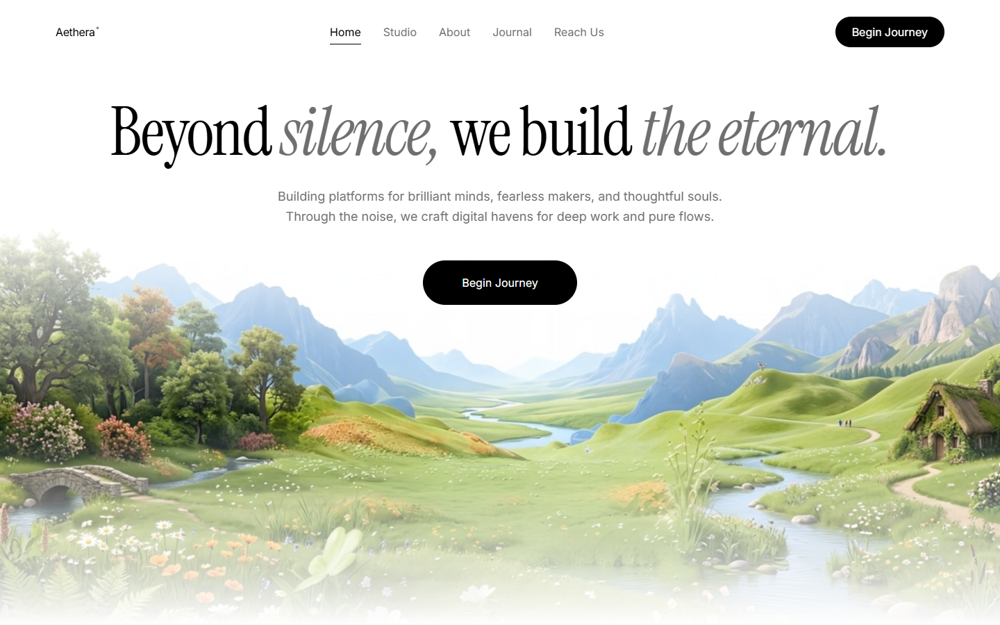
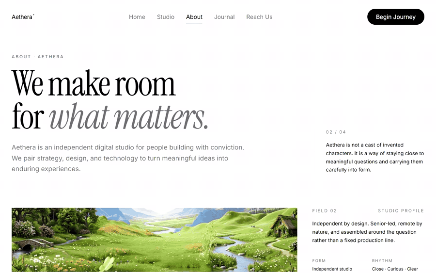
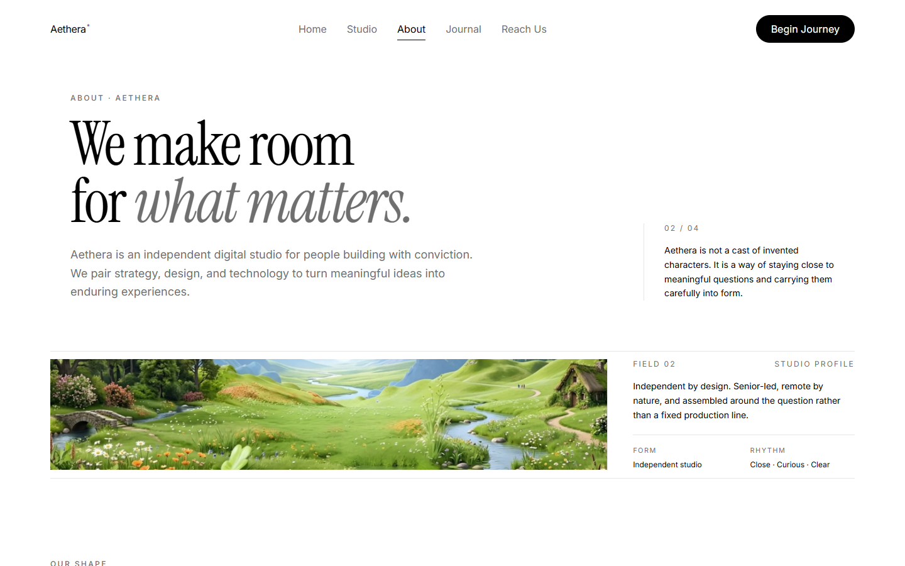
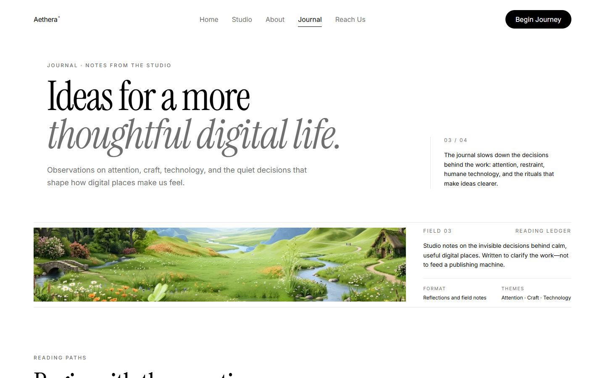
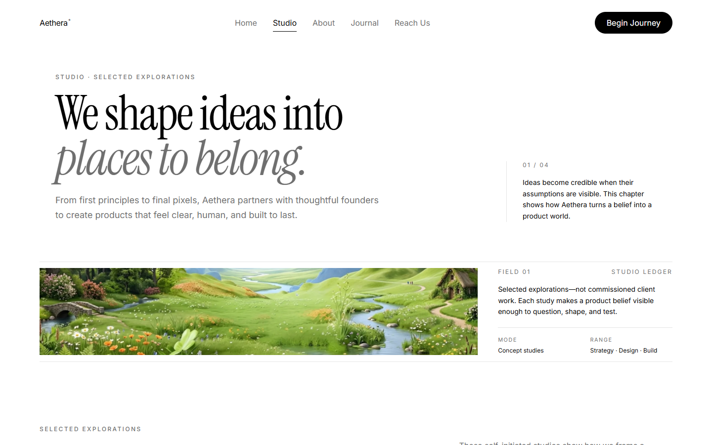
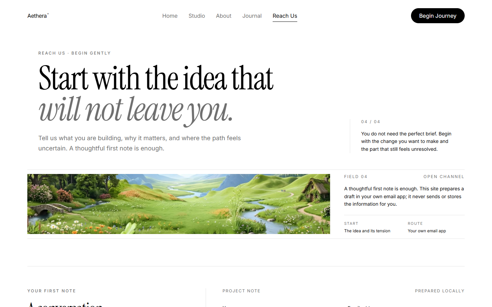
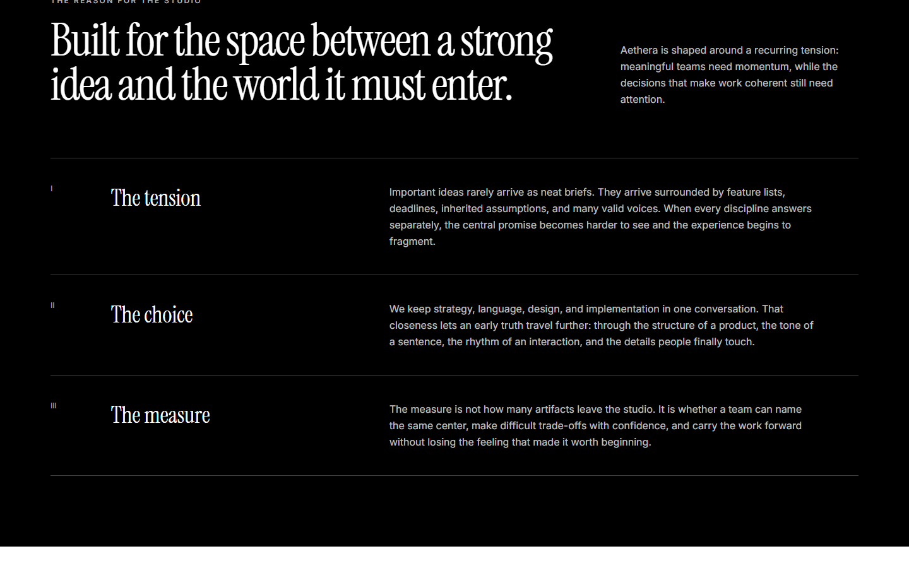
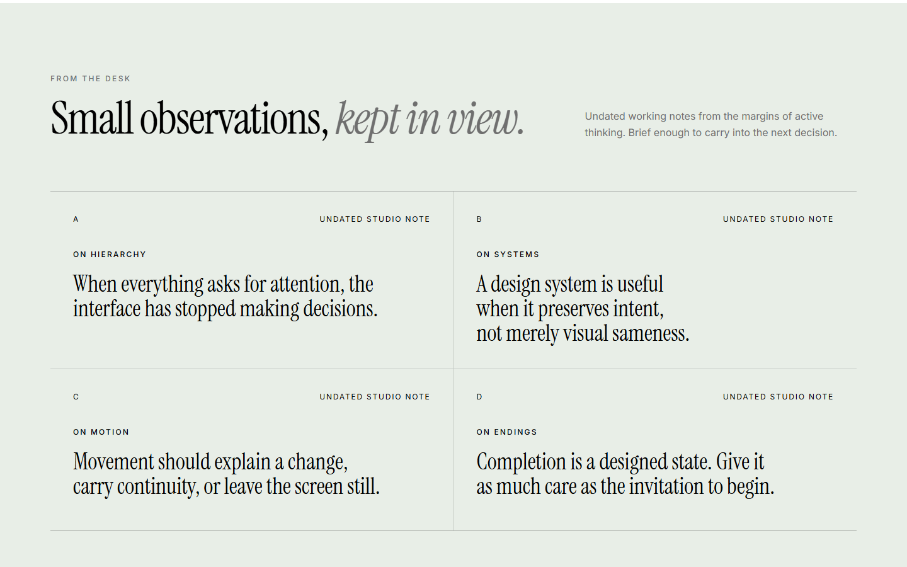
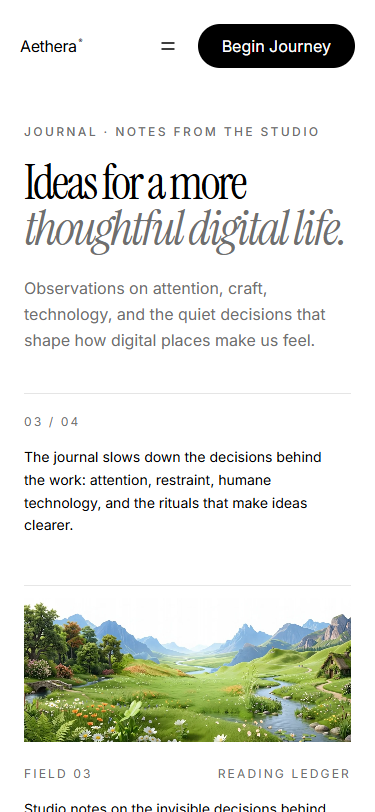
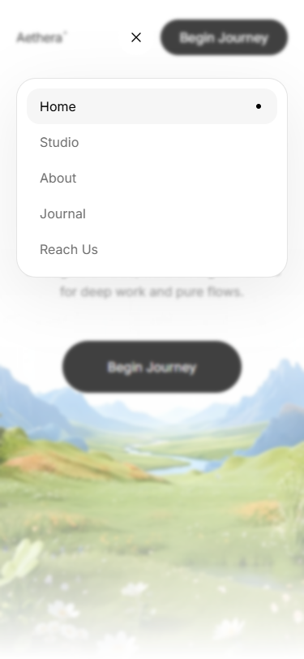

<div align="center">

# Aethera®

### A cinematic editorial studio experience for thoughtful digital work.

Built with React, Vite, Tailwind CSS, and TypeScript.

[View the live experience](https://aethera-chill-time-web.vercel.app) · [Explore the architecture](./docs/system-architecture.md) · [Read the product brief](./docs/project-overview-pdr.md)

</div>



Aethera is a complete five-route concept site for an independent digital studio. It pairs a hand-controlled cinematic video loop with a quiet editorial system, substantive interior pages, accessible navigation, and a privacy-conscious contact flow. Every image below was captured from the production build represented by this repository.

## The experience

| Route | Purpose | Signature detail |
|---|---|---|
| `/` | Cinematic introduction | Manual fade-in/fade-out video loop with a reduced-motion fallback |
| `/studio` | Selected explorations and capabilities | Editorial project list and capability ledger |
| `/about` | Studio character and working philosophy | Origin dossier, manifesto, working agreement, principles, and process |
| `/journal` | A growing archive of studio thinking | Seven native-expandable reflections, reading paths, and field notes |
| `/reach-us` | Project conversation | Validated, privacy-first email draft flow |
| `*` | Branded recovery | Clear route back into the experience |

### Motion study: the cinematic Home loop

The source video is intentionally not given the native `loop` attribute. React watches playback time and owns each fade, reset, and replay so the ending never cuts abruptly.


### Motion study: the editorial interior

About reads like an annotated studio dossier; Journal behaves like a small independent publication. The rhythm changes by section without breaking the monochrome visual language.



## Production gallery

| About — studio dossier | Journal — editorial archive |
|---|---|
|  |  |
| **Origin, manifesto, and working agreement** | **Reading paths, seven reflections, and field notes** |

| Studio — selected explorations | Reach Us — considered contact flow |
|---|---|
|  |  |

| About detail | Journal detail | Mobile Journal |
|---|---|---|
|  |  |  |

<details>
<summary><strong>Mobile navigation preview</strong></summary>



</details>

## Design and interaction system

- **Instrument Serif** carries the logo, headings, quotations, and expressive emphasis; **Inter** keeps navigation and body copy precise.
- A strict white, black, and `#6F6F6F` palette lets typography, spacing, and imagery create hierarchy.
- Responsive compositions are verified at 375, 768, and 1440 pixels rather than reduced to one repeated card grid.
- Journal entries use native `<details>` disclosure, stable hashes, semantic `<time>` elements, and same-page reading paths.
- The mobile menu is a true dialog layer with focus management, Escape dismissal, a trapped Tab cycle, and an opaque panel surface.
- Route changes restore scroll position, move focus predictably, and update page metadata.
- Reduced-motion visitors never receive the large MP4 source; they see the lightweight poster instead.

## Cinematic loop contract

[`use-cinematic-video-loop.ts`](./src/hooks/use-cinematic-video-loop.ts) and [`cinematic-video-layer.tsx`](./src/components/cinematic-video-layer.tsx) implement the Home sequence:

1. `requestAnimationFrame` continuously compares `currentTime` with `duration`.
2. The first 0.5 seconds map opacity from 0 to 1.
3. The final 0.5 seconds map opacity from 1 to 0.
4. `ended` forces opacity to 0, waits 100 ms, seeks to 0, and calls `play()` again.
5. Media errors and rejected playback preserve a clean white fallback.

The video starts 300 pixels below the viewport top and fills the remaining canvas beneath the prescribed gradient overlay. Content and the remote media URL live in [`hero-content.ts`](./src/lib/hero-content.ts).

## Architecture

```text
src/
├── components/       Editorial sections, navigation, contact, and media layers
├── hooks/            Cinematic loop lifecycle
├── lib/              Typed content and form-domain logic
├── pages/            Route-level compositions
├── styles/           Local font imports and animation/theme tokens
└── test/             Route, interaction, form, hero, and loop coverage
```

Content is kept separate from presentation so each route remains easy to review and extend. Components stay focused; all application source files remain below the project's 200-line modularity threshold.

## Run locally

Requirements: Node.js 22.22 or newer and npm.

```bash
git clone https://github.com/JasonTM17/Aethera_ChillTimeWeb.git
cd Aethera_ChillTimeWeb
npm install
npm run dev
```

Vite prints the local development URL. No runtime environment variables are required.

## Quality contract

```bash
npm run lint
npm run test:run
npm run test:coverage -- --pool=threads --maxWorkers=1 --no-file-parallelism
npm run build
npm audit --audit-level=high
```

Current verified baseline:

- 35 tests passing across 6 test files
- 97.11% statement coverage
- 88.43% branch coverage
- 100% function coverage
- 97.36% line coverage
- zero high-severity npm audit findings

## Deployment

Production is hosted on Vercel at [aethera-chill-time-web.vercel.app](https://aethera-chill-time-web.vercel.app). `npm run build` writes the static application to `dist/`.

- [`vercel.json`](./vercel.json) rewrites client-side routes to `index.html` on Vercel.
- [`public/_redirects`](./public/_redirects) provides the equivalent Netlify fallback.
- [Deployment guide](./docs/deployment-guide.md) covers checks and host requirements.
- [Production record](./docs/deployment.md) captures the verified release evidence.

## Repository documentation

| Document | What it covers |
|---|---|
| [Project overview and PDR](./docs/project-overview-pdr.md) | Product intent, scope, and acceptance criteria |
| [Codebase summary](./docs/codebase-summary.md) | Current modules, routes, and ownership boundaries |
| [Code standards](./docs/code-standards.md) | TypeScript, React, accessibility, and test conventions |
| [System architecture](./docs/system-architecture.md) | Runtime flow and component composition |
| [Design guidelines](./docs/design-guidelines.md) | Typography, palette, rhythm, motion, and responsive rules |
| [Project roadmap](./docs/project-roadmap.md) | Completed work and honest future opportunities |

## Product boundaries

This repository presents a fictional studio concept, not a claim of real clients, awards, team members, or audience metrics. Reach Us prepares a local `mailto:` draft; it does not upload or store contact data. A production business launch would still need a monitored mailbox, legal pages, analytics consent decisions, and an owned or licensed media strategy.

---

<div align="center">

Designed and engineered as a quiet place for deep work and pure flow.

</div>
