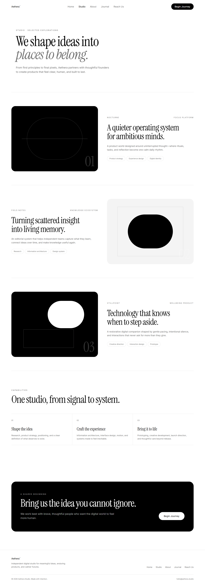

# Aethera Studio Site

A responsive five-route studio website built with React, Vite, Tailwind CSS, and TypeScript. Home is a fullscreen cinematic hero; Studio, About, Journal, and Reach Us extend the same editorial design system into a complete site.



## Routes

| Path | Purpose |
|---|---|
| `/` | Fullscreen cinematic Home hero |
| `/studio` | Selected explorations and capabilities |
| `/about` | Manifesto, principles, and process |
| `/journal` | Expandable studio reflections |
| `/reach-us` | Contact details and validated email-draft flow |
| `*` | Branded not-found recovery page |

## Stack

- React 19.2.7
- React Router 8.2.0
- Vite 8.1.5
- Tailwind CSS 4.3.3
- TypeScript 6.0.3
- Vitest 4.1.10 and Testing Library

React Router 8 requires Node.js 22.22 or newer. npm is the checked-in package manager.

## Run Locally

```bash
npm install
npm run dev
```

Open the local URL printed by Vite.

## Quality Commands

```bash
npm run lint
npm run test:run
npm run test:coverage -- --pool=threads --maxWorkers=1 --no-file-parallelism
npm run build
npm run preview
npm audit
```

Current verified result: 25 tests pass across 4 files. Coverage is 96.86% statements, 88.96% branches, 100% functions, and 96.75% lines.

## Cinematic Home Behavior

The decorative MP4 is positioned exactly 300px from the viewport top and fills the remaining hero. It does not use the native `loop` attribute.

- `requestAnimationFrame` maps the first 0.5s from opacity 0 to 1.
- The final 0.5s maps opacity 1 to 0.
- `ended` sets opacity to 0, waits 100ms, seeks to 0, then plays again.
- Playback rejection or a media error preserves the white fallback.
- Reduced-motion does not assign the 29 MiB MP4 source. It displays a 171KB WebP poster and remains paused.
- Normal playback uses `preload="metadata"`.

The video URL and editorial content are defined in [`src/lib/hero-content.ts`](./src/lib/hero-content.ts). Loop lifecycle logic lives in [`src/hooks/use-cinematic-video-loop.ts`](./src/hooks/use-cinematic-video-loop.ts).

## Contact Behavior

Reach Us validates name, email, project type, and message length. A valid submission creates a URL-encoded `mailto:` draft for `hello@aethera.studio`.

The website does not send, upload, or store contact data. Confirm that the configured mailbox is monitored before a public launch; update `siteContent.email` in [`src/lib/site-content.ts`](./src/lib/site-content.ts) if a different address is required.

## Deployment

Build output is written to `dist/`:

```bash
npm run build
```

Client-side routes require unknown paths to return `index.html`.

- Vercel: [`vercel.json`](./vercel.json) provides the rewrite.
- Netlify: [`public/_redirects`](./public/_redirects) is copied into the build.
- Other static hosts: configure an equivalent `/* → /index.html` fallback.

No deployment has been performed by this repository.

## Project Documentation

- [Project overview and PDR](./docs/project-overview-pdr.md)
- [Codebase summary](./docs/codebase-summary.md)
- [Code standards](./docs/code-standards.md)
- [System architecture](./docs/system-architecture.md)
- [Design guidelines](./docs/design-guidelines.md)
- [Deployment guide](./docs/deployment-guide.md)
- [Project roadmap](./docs/project-roadmap.md)

Detailed QA evidence and screenshots are stored in [`plans/260718-1608-cinematic-aethera-hero/reports`](./plans/260718-1608-cinematic-aethera-hero/reports).
